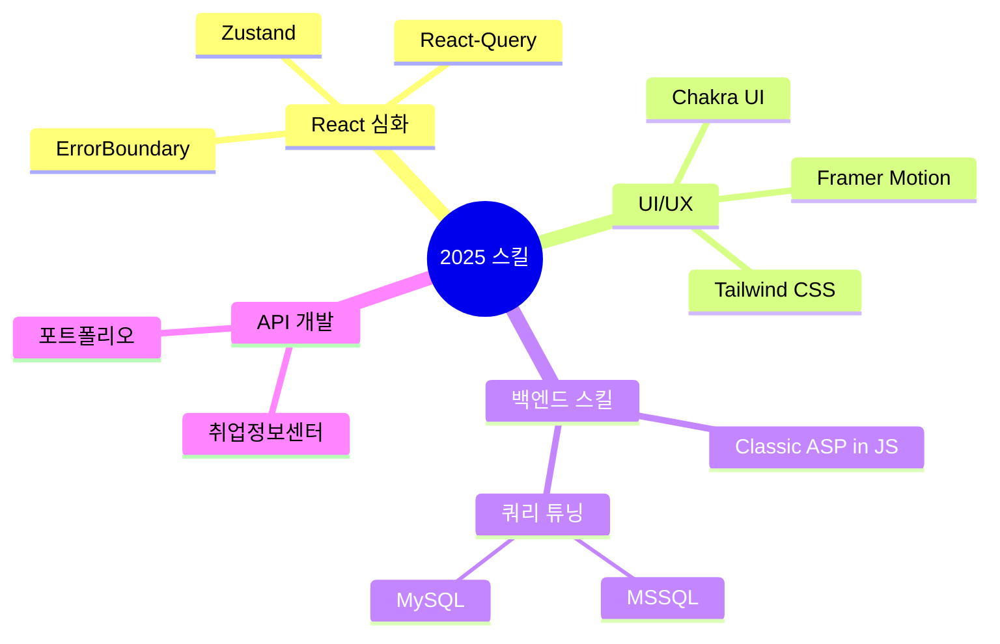

<div align="center">
  
# 🌨️ SnowsFE

> *"한 줄의 코드가 천 개의 픽셀보다 가치 있다"*

</div>

<br/>

## 👨‍💻 개발자 소개

안녕하세요! 프론트엔드 개발을 기반으로 MySQL, 백엔드 아키텍처, 네트워크 프로토콜까지 심층적으로 탐구하며, 풀스택 역량을 확장해 나가는 개발자입니다.
UX 최적화를 최우선으로 고려하며, 최신 기술 스택과 개발 패러다임을 빠르게 습득하여 실무에 적용하는 데 집중하고 있습니다.

<div align="center word-break:keep-all;">
  
  
</div>

<br/>

## 🛠️ 기술 스택

<table>
  <tr>
    <td align="center" width="96">
      
      <br>React
    </td>
    <td align="center" width="96">
      
      <br>JavaScript
    </td>
    <td align="center" width="96">
      
      <br>TypeScript
    </td>
    <td align="center" width="96">
      
      <br>Next.js
    </td>
    <td align="center" width="96">
      
      <br>Nginx
    </td>
    <td align="center" width="96">
      
      <br>GitHub
    </td>
  </tr>
  <tr>
    <td align="center" width="96">
      
      <br>Node.js
    </td>
    <td align="center" width="96">
      
      <br>REST API
    </td>
    <td align="center" width="96">
        
      <br>MongoDB
    </td>
    <td align="center" width="96">
      
      <br>My SQL
    </td>
    <td align="center" width="96">
      
      <br>GCP
    </td>
    <td align="center" width="96">
      
      <br>Ubuntu
    </td>
  </tr>
</table>

<br/>

## 🚀 특별한 프로젝트

<details>
<summary><b><a href="https://snowsfe.github.io/by-Snoer/" target="_blank">🎨 누구나 사용할 수 있는 Css Animation 효과! - by_Snoer</a></b></summary>
</details>

<details>
<summary><b>🏫 교육원 관리 시스템</b></summary>
<div>
<p>교육원 웹사이트 리뉴얼 및 관리자 페이지 개선 프로젝트</p>
<p>기술: React, Node.js, MS SQL Server</p>
</div>
</details>

## 🧠 학습 중인 기술


<br/>

## 📝 블로그 & 소셜

<p align="center">
  <a href="https://velog.io/@snowfe/posts">
    
  </a>
  <br />
  <a href="https://velog.io/@snowfe/posts">
    
  </a>
  <a href="https://www.youtube.com/channel/UC1iZXiMEallYFxN66sA1NwA">
    
  </a>
</p>

<br/>

## 📞 연락처

```javascript
const contact = {
  email: "snoerkr@gmail.com",
  phone: "010-8331-1930",
  social: {
    velog: "https://velog.io/@snowfe/posts",
    youtube: "https://www.youtube.com/channel/UC1iZXiMEallYFxN66sA1NwA"
  }
};
```

<div align="center">
  


</div>
