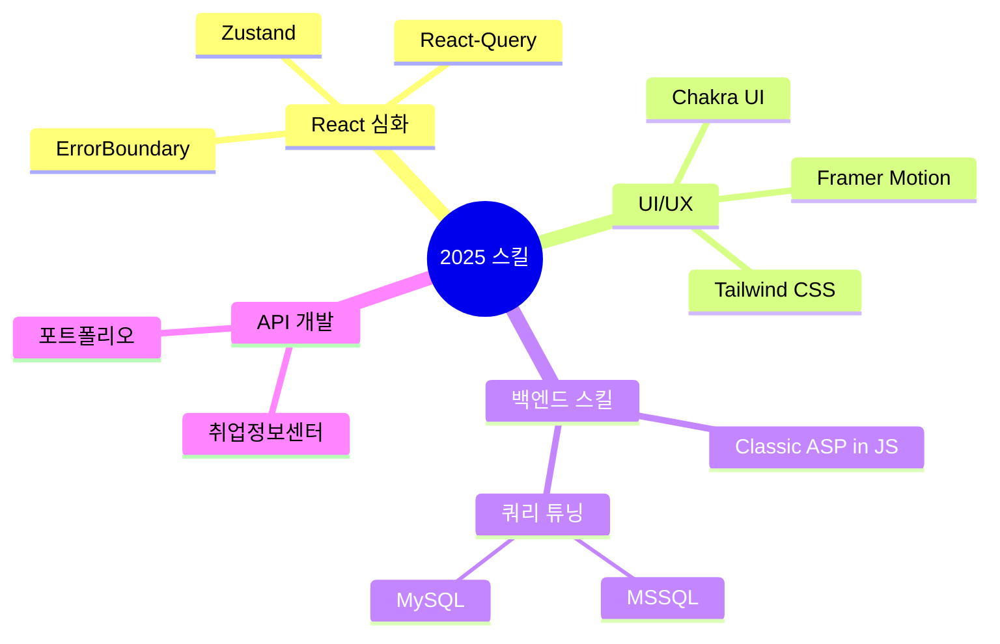

<div align="center">
  
# 🌨️ SnowsFE

> *"한 줄의 코드가 천 개의 픽셀보다 가치 있다"*

</div>

<br/>

## 👨‍💻 개발자 소개

안녕하세요!  
프론트엔드 개발을 기반으로 **MySQL, 백엔드 아키텍처, 네트워크 프로토콜**까지 <br/> 심층적으로 탐구하며, **풀스택 역량을 확장해 나가는 개발자**입니다.  

UX 최적화를 최우선으로 고려하며, 최신 기술 스택과 개발 패러다임을 빠르게 습득하여 실무에 적용하는 데 집중하고 있습니다.  

<div align="center">
  
  
</div>
<div align="center">
  
</div>

<br/>

## 🛠️ 기술 스택

<div align="center">
  
<table>
  <tr>
    <td align="center" width="96">
      
      <br>React
    </td>
    <td align="center" width="96">
      
      <br>JavaScript
    </td>
    <td align="center" width="96">
      
      <br>TypeScript
    </td>
    <td align="center" width="96">
      
      <br>Next.js
    </td>
    <td align="center" width="96">
      
      <br>Nginx
    </td>
    <td align="center" width="96">
      
      <br>GitHub
    </td>
  </tr>
  <tr>
    <td align="center" width="96">
      
      <br>Node.js
    </td>
    <td align="center" width="96">
      
      <br>REST API
    </td>
    <td align="center" width="96">
        
      <br>MongoDB
    </td>
    <td align="center" width="96">
      
      <br>My SQL
    </td>
    <td align="center" width="96">
      
      <br>GCP
    </td>
    <td align="center" width="96">
      
      <br>Ubuntu
    </td>
  </tr>
</table>

</div>

<br/>

<div align="center">
  <h1>🎭 𝕊𝕡𝕖𝕔𝕚𝕒𝕝 ℙ𝕣𝕠𝕛𝕖𝕔𝕥𝕤</h1>
  <p><i>혁신적인 웹 경험을 창조합니다</i></p>
  <br/>
</div>

<br/>

<div align="center">
  
</div>

<br/>

<div style="perspective: 1000px;">
  <div style="transform: rotateY(10deg); transform-style: preserve-3d; box-shadow: rgba(0, 0, 0, 0.4) 0px 30px 90px; border-radius: 10px; padding: 20px; margin-bottom: 50px; background: linear-gradient(135deg, #6e8efb, #a777e3);">
    <h2>🎨 𝒜𝓃𝒾𝓂𝒶𝓉𝒾𝑜𝓃 𝒢𝒶𝓁𝓁𝑒𝓇𝓎</h2>
    <p>
      <a href="https://snowsfe.github.io/by-Snoer/" target="_blank">
        <b>누구나 사용할 수 있는 Css Animation 효과! - by_Snoer</b>
      </a>
    </p>
    <p>최신 CSS 애니메이션 트렌드를 한눈에 보고 적용해보세요.</p>
  </div>

  <div style="transform: rotateY(-10deg); transform-style: preserve-3d; box-shadow: rgba(0, 0, 0, 0.4) 0px 30px 90px; border-radius: 10px; padding: 20px; background: linear-gradient(135deg, #11998e, #38ef7d);">
    <h2>🏫 𝐸𝒹𝓊𝒸𝒶𝓉𝒾𝑜𝓃 𝒫𝑜𝓇𝓉𝒶𝓁</h2>
    <p><b>교육원 웹사이트 리뉴얼 및 관리자 페이지 개선 프로젝트</b></p>
    <br/>
    <p>
      <span style="display: inline-block; margin: 5px; padding: 8px 15px; background: rgba(255,255,255,0.2); border-radius: 20px; font-weight: bold;">React</span>
      <span style="display: inline-block; margin: 5px; padding: 8px 15px; background: rgba(255,255,255,0.2); border-radius: 20px; font-weight: bold;">Node.js</span>
      <span style="display: inline-block; margin: 5px; padding: 8px 15px; background: rgba(255,255,255,0.2); border-radius: 20px; font-weight: bold;">MS SQL Server</span>
    </p>
  </div>
</div>

<br/>

## 🧠 학습 중인 기술


<br/>

## 📝 블로그 & 소셜

<p align="center">
  <a href="https://velog.io/@snowfe/posts">
    
  </a>
  <br />
  <a href="https://velog.io/@snowfe/posts">
    
  </a>
  <a href="https://www.youtube.com/channel/UC1iZXiMEallYFxN66sA1NwA">
    
  </a>
</p>

<br/>

## 📞 연락처

```javascript
const contact = {
  email: "snoerkr@gmail.com",
  phone: "010-8331-1930",
  social: {
    velog: "https://velog.io/@snowfe/posts",
    youtube: "https://www.youtube.com/channel/UC1iZXiMEallYFxN66sA1NwA"
  }
};
```

<div align="center">
  


</div>
