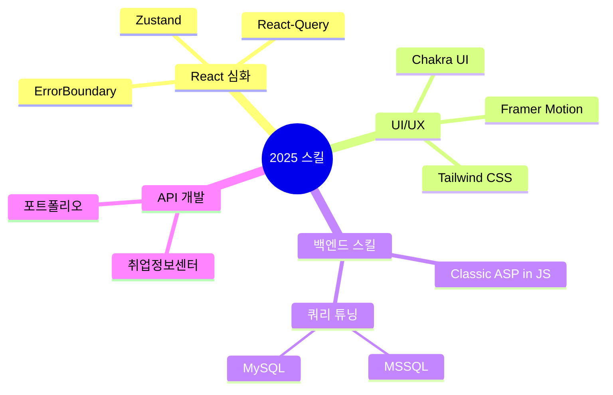

<div align="center">
  
# 🌨️ SnowsFE

> *"한 줄의 코드가 천 개의 픽셀보다 가치 있다"*

</div>

## 1. 회전 카운터 스타일


## 2. 펄스 효과 스타일


## 3. 미니멀 스타일


## 4. 디지털 카운터 스타일


## 5. 어두운 테마 스타일


<br/>

## 👨‍💻 개발자 소개

안녕하세요!  
프론트엔드 개발을 기반으로 **MySQL, 백엔드 아키텍처, 네트워크 프로토콜**까지 <br/> 심층적으로 탐구하며, **풀스택 역량을 확장해 나가는 개발자**입니다.  

UX 최적화를 최우선으로 고려하며, 최신 기술 스택과 개발 패러다임을 빠르게 습득하여 실무에 적용하는 데 집중하고 있습니다.  

<div align="center">
  
  
</div>
<div align="center">
  
</div>

<br/>

## 🛠️ 기술 스택
<br/>

<div align="center">
  
<table>
  <tr>
    <td align="center" width="96">
      
      <br>React
    </td>
    <td align="center" width="96">
      
      <br>JavaScript
    </td>
    <td align="center" width="96">
      
      <br>TypeScript
    </td>
    <td align="center" width="96">
      
      <br>Next.js
    </td>
    <td align="center" width="96">
      
      <br>Nginx
    </td>
    <td align="center" width="96">
      
      <br>GitHub
    </td>
  </tr>
  <tr>
    <td align="center" width="96">
      
      <br>Node.js
    </td>
    <td align="center" width="96">
      
      <br>REST API
    </td>
    <td align="center" width="96">
        
      <br>MongoDB
    </td>
    <td align="center" width="96">
      
      <br>My SQL
    </td>
    <td align="center" width="96">
      
      <br>GCP
    </td>
    <td align="center" width="96">
      
      <br>Ubuntu
    </td>
  </tr>
</table>

</div>

<br/>

## 📔 2025 개발 일지
<br/>
<div align="center">
  <p></p>
<table>
  <tr>
    <td width="50%">
      <h3 align="center">🎨 CSS 애니메이션 라이브러리</h3>
      <p align="center"><b>by-Snoer</b></p>
      <p align="center"><i>"누구나 쉽게 활용할 수 있는 CSS 애니메이션!"</i></p>
      <p align="center">
        <a href="https://snowsfe.github.io/by-Snoer/" target="_blank">
          
        </a>
      </p>
      <p align="right">
        <code>#애니메이션</code> <code>#CSS</code> <code>#웹디자인</code>
      </p>
    </td>
    <td width="50%">
      <h3 align="center">🎓 교육 포털 시스템</h3>
      <p align="center"><b>LMS 교육원 리뉴얼 및 학습 관리 기능 개선</b></p>
      <p align="center">
        
        
        
      </p>
      <p align="right">
        <code>#웹개발</code> <code>#데이터베이스</code> <code>#시스템개선</code>
      </p>
    </td>
  </tr>
</table>
</div>

<br/>

## 🧠 학습 중인 기술
<br/>


<br/>

## 📝 블로그 & 소셜
<br/>

<p align="center">
  <a href="https://velog.io/@snowfe/posts">
    
  </a>
  <br />
  <a href="https://velog.io/@snowfe/posts">
    
  </a>
  <a href="https://www.youtube.com/channel/UC1iZXiMEallYFxN66sA1NwA">
     
  </a>
</p>

<br/>

## 📞 연락처

```javascript
const contact = {
  email: "snoerkr@gmail.com",
  phone: "010-8331-1930",
  social: {
    velog: "https://velog.io/@snowfe/posts",
    youtube: "https://www.youtube.com/channel/UC1iZXiMEallYFxN66sA1NwA"
  }
};
```

<div align="center">
  


</div>
