<div align="center">
  <h1 align="center">
    🌨️ Snoer
  </h1>
  <div align="right">
    
  </div>
  
> *"빈틈없는 기획, 확장성있는 설계"*
</div>

<br/> 

## 👨‍💻 개발자 소개

안녕하세요😊<br>
**웹서비스를 직접 설계·구현하는 풀스택 개발자**입니다!

**설계 → 데이터베이스 모델링 → 백엔드 API → 프론트엔드 UI/UX → 배포**까지 <br>
**서비스 전 과정을 스스로 구현**하며 사용자 경험과 보안을 동시에 고려합니다🎯

<div align="center">
  
  
</div>
<div align="center">
  
</div>

<br/>

## 🛠️ 기술 스택
<br/>

<div align="center">
  
<table>
  <tr>
    <td align="center" width="96">
      
      <br>JavaScript
    </td>
    <td align="center" width="96">
      
      <br>TypeScript
    </td>
    <td align="center" width="96">
      
      <br>React
    </td>
    <td align="center" width="96">
      
      <br>Node.js
    </td>
    <td align="center" width="96">
      
      <br>Prisma
    </td>    
    <td align="center" width="96">
      
      <br>Next.js
    </td>
    <td align="center" width="96">
      
      <br>Nginx
    </td>      
  </tr>
  <tr>
    <td align="center" width="96">
        
      <br>MongoDB
    </td>
    <td align="center" width="96">
      
      <br>My SQL
    </td>
    <td align="center" width="96">
      
      <br>MS SQL
    </td>
    <td align="center" width="96">
      
      <br>GCP
    </td>
    <td align="center" width="96">
      
      <br>Kakao Cloud
    </td>    
    <td align="center" width="96">
      
      <br>정처기
    </td>
    <td align="center" width="96">
      
      <br>SQLD
    </td>      
  </tr>
</table>

</div>

<br/>

## 📔 2025 개발 일지
<br/>
<div align="center">
  <p></p>
<table>
  <tr>
    <td width="50%">
      <h3 align="center">🎨 CSS 애니메이션 라이브러리</h3>
      <p align="center"><b>by-Snoer</b></p>
      <p align="center"><i>"누구나 쉽게 활용할 수 있는 CSS 애니메이션!"</i></p>
      <p align="center">
        <a href="https://snowsfe.github.io/by-Snoer/" target="_blank">
          
          <br/>          
          
        </a>
      </p>
      <p align="right">
        <code>#애니메이션</code> <code>#CSS</code> <code>#웹디자인</code>
      </p>
    </td>
    <td width="50%">
      <h3 align="center">🎓 교육 포털 시스템</h3>
      <p align="center"><b>LMS 교육원 리뉴얼 및 학습 관리 기능 개선</b></p>
      <p align="center">
        
        
        
      </p>
      <p align="right">
        <code>#웹개발</code> <code>#쿼리튜닝</code> <code>#시스템개선</code>
      </p>
    </td>
  </tr>
</table>
</div>

<br/>

## 📔 2026 개발 일지
<br/>
<div align="center">
  <p></p>
<table>
  <tr>
    <td width="50%">
      <h3 align="center">🧩 Popolling 포트폴리오 에디터</h3>
      <p align="center"><b>개발자 포트폴리오 제작 · 평가 플랫폼</b></p>
      <p align="center">
        <i>"자유 캔버스로 작업하고,<br/>정규화된 기준으로 평가받는 포트폴리오"</i>
      </p>
      <p align="center">
        
        
        
        
      </p>
      <p align="right">
        <code>#캔버스에디터</code> <code>#성능최적화</code> <code>#풀스택</code>
      </p>
    </td>
    <td width="50%">
      <h3 align="center">🔐 인증 · 아키텍처 고도화</h3>
      <p align="center"><b>실서비스 기준 백엔드 구조 설계</b></p>
      <p align="center">
        <i>"보안·확장성·운영을 고려한<br/>인증 및 데이터 흐름 설계"</i>
      </p>
      <p align="center">
        
        
        
        
      </p>
      <p align="right">
        <code>#인증설계</code> <code>#보안</code> <code>#백엔드</code>
      </p>
    </td>
  </tr>
</table>
</div>

<br/>

## 🧠 스노어 기술 성장 맵

```mermaid
mindmap
  root((요즘 개발))
    
    React
      성능
        리렌더링 최소화
        RAF 기반 Live Override
        useRef 중심 실시간 처리
      상태관리
        Zustand
        전역 / 로컬 상태 분리
      UI
        캔버스 인터랙션
        드래그 / 리사이즈
        스냅 가이드

    Backend
      Node.js
        API 설계
        인증 구조
      Prisma
        스키마 설계

    Database
      SQL 설계
      쿼리 튜닝

    개발 감각
      UX 체감 성능
      구조 먼저 생각하기
```

<br/>


<br/>

## 🏗️ 스노어 아키텍처 IA

```mermaid
graph TD
    %% User & Cloud Layer
    User[👤 Snoer / Test]
    Cloud{☁️ Kakao Cloud<br/>Infrastructure}
    
    %% Frontend Flow
    User -->|Interaction| UI[🎨 Canvas UI<br/>Drag · Resize · Select]
    UI --> Live[⚡ Live Override<br/>RAF + useRef]
    Live -->|Transform| DOM[🖼️ DOM Update]
    UI -->|Interaction End| Commit[✅ Commit Changes]
    Commit --> Store[📦 Zustand Store]
    Store --> History[↩️ Undo / Redo Stack]
    Store -->|Optimized| Render[🔄 Minimal Re-render]
    
    %% API Call
    Store -->|HTTP Request| API[🌐 Backend API]
    
    %% Nginx Entry
    Cloud -->|Host| Nginx[🔀 Nginx<br/>Reverse Proxy]
    API --> Nginx
    Nginx --> Router[🚏 Router Layer]
    
    %% Backend Layers
    Router --> Auth{🔐 Auth Middleware<br/>JWT Verify}
    Auth -->|✓ Valid| Controller[🎮 Controller]
    Auth -->|✗ Invalid| Reject[❌ 401 Unauthorized]
    
    Controller --> Service[⚙️ Service Logic]
    Service --> ORM[🗃️ Prisma ORM]
    
    %% Database
    ORM --> DB[(💾 MySQL / MSSQL<br/>Persistent Layer)]
    
    %% Error Handling
    Controller -->|Try-Catch| ErrHandler[⚠️ Error Handler]
    Service -->|Business Error| ErrHandler
    ORM -->|DB Error| ErrHandler
    ErrHandler -->|Formatted Error| Nginx
    
    %% Shared Resources
    Service -.->|Use| Utils[🛠️ Utils / Helpers]
    Service -.->|Import| Types[📝 Shared Types<br/>Cross-layer]
    Controller -.->|Import| Types
    
    %% Auth System (Separate Flow)
    AuthService[🔑 Auth Service]
    AuthService -->|Issue Token| TokenGen[🎫 JWT + Refresh Token]
    AuthService --> ORM
    Controller -->|Login/Refresh| AuthService
    
    %% Response Flow
    DB -.->|Query Result| ORM
    ORM -.->|Data| Service
    Service -.->|Business Data| Controller
    Controller -.->|JSON Response| Nginx
    Nginx -.->|HTTP Response| Store
    Store -.->|Update UI| Render
    
    %% SSE Flow
    Service -->|Event Stream| SSE[📡 SSE Connection]
    SSE -.->|Real-time Update| Store
    
    %% Styling
    classDef frontend fill:#61DAFB,stroke:#282c34,stroke-width:2px,color:#000
    classDef backend fill:#68A063,stroke:#333,stroke-width:2px,color:#fff
    classDef infra fill:#F05032,stroke:#333,stroke-width:2px,color:#fff
    classDef db fill:#4479A1,stroke:#333,stroke-width:2px,color:#fff
    classDef auth fill:#000,stroke:#fb015b,stroke-width:3px,color:#fff
    classDef util fill:#888,stroke:#333,stroke-width:1px,color:#fff
    classDef error fill:#e74c3c,stroke:#c0392b,stroke-width:2px,color:#fff
    
    class UI,Live,DOM,Commit,Store,History,Render frontend
    class Router,Controller,Service,ORM backend
    class Nginx,Cloud infra
    class DB db
    class Auth,AuthService,TokenGen auth
    class Utils,Types,SSE util
    class ErrHandler,Reject error
```

<br/>


<br/>

## 📝 블로그 & 소셜
<br/>

<p align="center">
  <a href="https://velog.io/@snowfe/posts">
    
  </a>
  <br />
  <a href="https://velog.io/@snowfe/posts">
    
  </a>
  <a href="https://www.youtube.com/channel/UC1iZXiMEallYFxN66sA1NwA">
     
  </a>
</p>

<br/>

## 📞 연락처

```javascript
const contact = {
  email: "snoerkr@gmail.com",
  phone: "010-8331-1930",
  social: {
    velog: "https://velog.io/@snowfe/posts",
  }
};
```

<div align="center">
  


</div>
