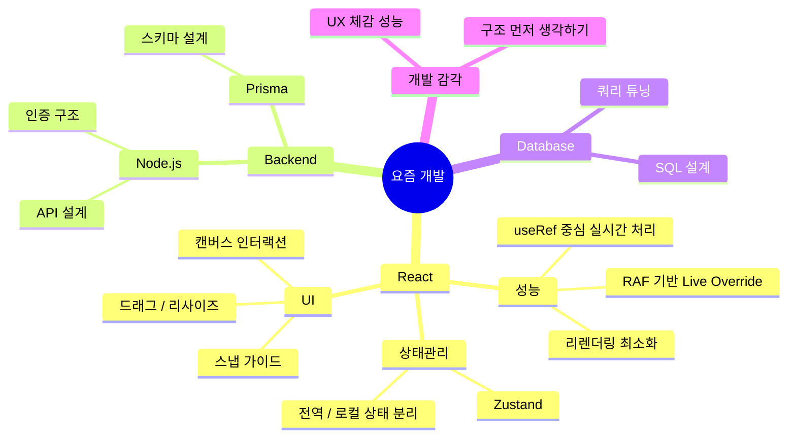
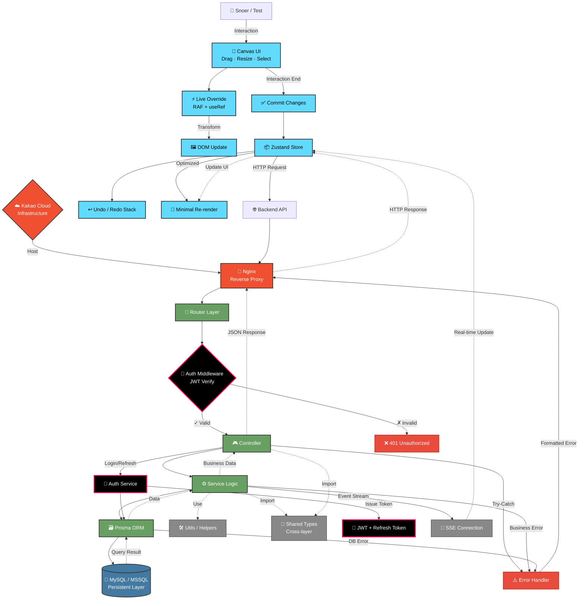

<div align="center">
  <h1 align="center">
    🌨️ Snoer
  </h1>
  <div align="right">
    
  </div>
  
> *"빈틈없는 기획, 확장성있는 설계"*
</div>

<br/> 

## 👨‍💻 개발자 소개


<div>
  <h1>Hi there, I'm SnowsFE 👋</h1>
  <p><b>웹서비스를 직접 설계·구현하는 풀스택 개발자</b>입니다!</p>
  <p>
    설계부터 데이터베이스 모델링, 백엔드 API, 프론트엔드 UI/UX, <br>
    그리고 배포까지 서비스 전 과정을 스스로 구현합니다. 🎯
  </p>
  <p>사용자 경험과 보안을 최우선으로 고려하며 최적의 솔루션을 고민합니다.</p>
</div>

<br clear="right" />

<table width="100%">
  <tr>
    <td width="60%" style="vertical-align: top;">
      <h2>안녕하세요! 😊</h2>
      <p><b>웹서비스를 직접 설계·구현하는 풀스택 개발자</b>입니다!</p>
      <p>설계 → 데이터베이스 모델링 → 백엔드 API → 프론트엔드 UI/UX → 배포까지<br>
      <b>서비스 전 과정을 스스로 구현</b>하며 사용자 경험과 보안을 동시에 고려합니다.</p>
    </td>
    <td width="40%" align="center">
      
    </td>
  </tr>
</table>

<br/>

## 🛠️ 기술 스택
<br/>

<div align="center">
  
<table>
  <tr>
    <td align="center" width="96">
      
      <br>JavaScript
    </td>
    <td align="center" width="96">
      
      <br>TypeScript
    </td>
    <td align="center" width="96">
      
      <br>React
    </td>
    <td align="center" width="96">
      
      <br>Node.js
    </td>
    <td align="center" width="96">
      
      <br>Prisma
    </td>    
    <td align="center" width="96">
      
      <br>Next.js
    </td>
    <td align="center" width="96">
      
      <br>Nginx
    </td>      
  </tr>
  <tr>
    <td align="center" width="96">
        
      <br>MongoDB
    </td>
    <td align="center" width="96">
      
      <br>My SQL
    </td>
    <td align="center" width="96">
      
      <br>MS SQL
    </td>
    <td align="center" width="96">
      
      <br>GCP
    </td>
    <td align="center" width="96">
      
      <br>Kakao Cloud
    </td>    
    <td align="center" width="96">
      
      <br>정처기
    </td>
    <td align="center" width="96">
      
      <br>SQLD
    </td>      
  </tr>
</table>

</div>

<br/>

## 📔 2025 개발 일지
<br/>
<div align="center">
  <p></p>
<table>
  <tr>
    <td width="50%">
      <h3 align="center">🎨 CSS 애니메이션 라이브러리</h3>
      <p align="center"><b>by-Snoer</b></p>
      <p align="center"><i>"누구나 쉽게 활용할 수 있는 CSS 애니메이션!"</i></p>
      <p align="center">
        <a href="https://snowsfe.github.io/by-Snoer/" target="_blank">
          
          <br/>          
          
        </a>
      </p>
      <p align="right">
        <code>#애니메이션</code> <code>#CSS</code> <code>#웹디자인</code>
      </p>
    </td>
    <td width="50%">
      <h3 align="center">🎓 교육 포털 시스템</h3>
      <p align="center"><b>LMS 교육원 리뉴얼 및 학습 관리 기능 개선</b></p>
      <p align="center">
        
        
        
      </p>
      <p align="right">
        <code>#웹개발</code> <code>#쿼리튜닝</code> <code>#시스템개선</code>
      </p>
    </td>
  </tr>
</table>
</div>

<br/>

## 📔 2026 개발 일지
<br/>
<div align="center">
  <p></p>
<table>
  <tr>
    <td width="50%">
      <h3 align="center">🧩 Popolling 포트폴리오 에디터</h3>
      <p align="center"><b>개발자 포트폴리오 제작 · 평가 플랫폼</b></p>
      <p align="center">
        <i>"자유 캔버스로 작업하고,<br/>정규화된 기준으로 평가받는 포트폴리오"</i>
      </p>
      <p align="center">
        
        
        
        
      </p>
      <p align="right">
        <code>#캔버스에디터</code> <code>#성능최적화</code> <code>#풀스택</code>
      </p>
    </td>
    <td width="50%">
      <h3 align="center">🔐 인증 · 아키텍처 고도화</h3>
      <p align="center"><b>실서비스 기준 백엔드 구조 설계</b></p>
      <p align="center">
        <i>"보안·확장성·운영을 고려한<br/>인증 및 데이터 흐름 설계"</i>
      </p>
      <p align="center">
        
        
        
        
      </p>
      <p align="right">
        <code>#인증설계</code> <code>#보안</code> <code>#백엔드</code>
      </p>
    </td>
  </tr>
</table>
</div>

<br/>

## 🧠 스노어 기술 성장 맵
<br/>


<br/>

## 🏗️ 스노어 아키텍처 IA
<br/>


<br/>

## 📝 블로그 & 소셜
<br/>

<p align="center">
  <a href="https://velog.io/@snowfe/posts">
    
  </a>
  <br />
  <a href="https://velog.io/@snowfe/posts">
    
  </a>
  <a href="https://www.youtube.com/channel/UC1iZXiMEallYFxN66sA1NwA">
     
  </a>
</p>

<br/>

## 📞 연락처

```javascript
const contact = {
  email: "snoerkr@gmail.com",
  phone: "010-8331-1930",
  social: {
    velog: "https://velog.io/@snowfe/posts",
  }
};
```
