<div align="center">
  
# 🌨️ Snow의 개발 세계


> *"한 줄의 코드가 천 개의 픽셀보다 가치 있다"*

</div>

## 👨‍💻 개발자 소개

안녕하세요! 프론트엔드 개발과 웹 기술에 열정을 가진 개발자입니다. 사용자 경험을 최우선으로 생각하며, 항상 최신 기술 트렌드를 따라가려고 노력합니다.

<div align="center">
  
  
</div>

## 🛠️ 기술 스택

<table>
  <tr>
    <td align="center" width="96">
      
      <br>React
    </td>
    <td align="center" width="96">
      
      <br>JavaScript
    </td>
    <td align="center" width="96">
      
      <br>TypeScript
    </td>
    <td align="center" width="96">
      
      <br>Next.js
    </td>
    <td align="center" width="96">
      
      <br>Nginx
    </td>
    <td align="center" width="96">
      
      <br>GitHub
    </td>
  </tr>
  <tr>
    <td align="center" width="96">
      
      <br>Node.js
    </td>
    <td align="center" width="96">
      
      <br>REST API
    </td>
    <td align="center" width="96">
      
      <br>MongoDB
    </td>
    <td align="center" width="96">
      
      <br>MS SQL
    </td>
    <td align="center" width="96">
      
      <br>GCP
    </td>
    <td align="center" width="96">
      
      <br>Ubuntu
    </td>
  </tr>
</table>

## 🚀 특별한 프로젝트

<details>
<summary><b>🎨 Snoer Animation</b></summary>
<div>
<h4><a href="https://snowsfe.github.io/by-Snoer/" target="_blank">프로젝트 링크</a></h4>
<p>직접 만든 애니메이션 라이브러리로, 웹 개발자들에게 쉽고 효과적인 애니메이션 솔루션을 제공합니다.</p>
<p>기술: CSS, JavaScript</p>
</div>
</details>

<details>
<summary><b>🏫 교육원 관리 시스템</b></summary>
<div>
<p>교육원 웹사이트 리뉴얼 및 관리자 페이지 개선 프로젝트</p>
<p>기술: React, Node.js, MS SQL Server</p>
</div>
</details>

## 🧠 학습 중인 기술

```mermaid
mindmap
  root((2025 스킬))
    React 심화
      Zustand
      React-Query
      ErrorBoundary
    UI/UX
      Chakra UI
      Framer Motion
      Tailwind CSS
    백엔드 스킬
      Classic ASP in JS
      쿼리 튜닝
        MSSQL
        MySQL
    API 개발
      취업정보센터
      포트폴리오
```



## 📝 블로그 & 소셜

<p align="center">
  <a href="https://velog.io/@snowfe/posts">
    
  </a>
  <a href="https://www.youtube.com/channel/UC1iZXiMEallYFxN66sA1NwA">
    
  </a>
</p>

## 📞 연락처

```javascript
const contact = {
  email: "snoerkr@gmail.com",
  phone: "010-8331-1930",
  social: {
    velog: "https://velog.io/@snowfe/posts",
    youtube: "https://www.youtube.com/channel/UC1iZXiMEallYFxN66sA1NwA"
  }
};
```

<div align="center">
  


</div>
