<div align="center">
  
# 🌨️ SnowsFE

> *"한 줄의 코드가 천 개의 픽셀보다 가치 있다"*

</div>

<br/>

## 👨‍💻 개발자 소개

안녕하세요! 프론트엔드 개발을 기반으로 MySQL, 백엔드 아키텍처, 네트워크 프로토콜까지 심층적으로 탐구하며, 풀스택 역량을 확장해 나가는 개발자입니다.
UX 최적화를 최우선으로 고려하며, 최신 기술 스택과 개발 패러다임을 빠르게 습득하여 실무에 적용하는 데 집중하고 있습니다.

<div align="center word-break:keep-all;">
  
  
</div>

<br/>

## 🛠️ 기술 스택

<table>
  <tr>
    <td align="center" width="96">
      
      <br>React
    </td>
    <td align="center" width="96">
      
      <br>JavaScript
    </td>
    <td align="center" width="96">
      
      <br>TypeScript
    </td>
    <td align="center" width="96">
      
      <br>Next.js
    </td>
    <td align="center" width="96">
      
      <br>Nginx
    </td>
    <td align="center" width="96">
      
      <br>GitHub
    </td>
  </tr>
  <tr>
    <td align="center" width="96">
      
      <br>Node.js
    </td>
    <td align="center" width="96">
      
      <br>REST API
    </td>
    <td align="center" width="96">
        
      <br>MongoDB
    </td>
    <td align="center" width="96">
      
      <br>My SQL
    </td>
    <td align="center" width="96">
      
      <br>GCP
    </td>
    <td align="center" width="96">
      
      <br>Ubuntu
    </td>
  </tr>
</table>

<br/>

## 🚀 특별한 프로젝트

<details>
<summary><b>🎨 찾아도 없어서 직접 만든! Snoer Animation</b></summary>
  <a href="https://snowsfe.github.io/by-Snoer/" target="_blank"></a>
</details>

<details>
<summary><b>🏫 교육원 관리 시스템</b></summary>
<div>
<p>교육원 웹사이트 리뉴얼 및 관리자 페이지 개선 프로젝트</p>
<p>기술: React, Node.js, MS SQL Server</p>
</div>
</details>

## 🧠 학습 중인 기술

```mermaid
mindmap
  root((2025 스킬))
    React 심화
      Zustand
      React-Query
      ErrorBoundary
    UI/UX
      Chakra UI
      Framer Motion
      Tailwind CSS
    백엔드 스킬
      Classic ASP in JS
      쿼리 튜닝
        MSSQL
        MySQL
    API 개발
      취업정보센터
      포트폴리오
```



## 📝 블로그 & 소셜

<p align="center">
  <a href="https://velog.io/@snowfe/posts">
    
  </a>
  <a href="https://www.youtube.com/channel/UC1iZXiMEallYFxN66sA1NwA">
    
  </a>
</p>

## 📞 연락처

```javascript
const contact = {
  email: "snoerkr@gmail.com",
  phone: "010-8331-1930",
  social: {
    velog: "https://velog.io/@snowfe/posts",
    youtube: "https://www.youtube.com/channel/UC1iZXiMEallYFxN66sA1NwA"
  }
};
```

<div align="center">
  


</div>

<div align="center">
  
</div>

<p align="center">
  
</p>

<div align="center">
  
  [](https://velog.io/@snowfe/posts)
  [](mailto:snoerkr@gmail.com)
  [](https://www.youtube.com/channel/UC1iZXiMEallYFxN66sA1NwA)
  
</div>

##  GitHub 통계

<div align="center">
  
  
</div>

##  기술 스택

### 🌐 Frontend
<div align="center">
  
  
  
  
  
  
</div>

### ⚙️ Backend & Database
<div align="center">
  
  
  
  
</div>

### 🔧 DevOps & Tools
<div align="center">
  
  
  
</div>

##  학습 ë° 프로젝트

<div align="center">
  <table>
    <tr>
      <td>
        <h3 align="center">🔭 현재 작업 중인 프로젝트</h3>
        <div align="center">
          <p>교육원 리뉴얼 및 관리자 페이지 개선</p>
        </div>
      </td>
      <td>
        <h3 align="center">🎨 오리지널 리소스</h3>
        <div align="center">
          <p><a href="https://snowsfe.github.io/by-Snoer/">Snoer Animation</a></p>
        </div>
      </td>
    </tr>
  </table>
</div>

### 🌱 학습 중인 기술
<div align="center">
  <table>
    <tr>
      <td> 2025 React 기능 (Zustand, React-Query, ErrorBoundary)</td>
      <td> API 수집 ë° 활용</td>
    </tr>
    <tr>
      <td> React Chakra UI + Framer Motion</td>
      <td> Tailwind CSS</td>
    </tr>
    <tr>
      <td> Classic ASP in js</td>
      <td> MsSql, MySql 쿼리 튜닝</td>
    </tr>
  </table>
</div>

## 📫 연락처

<div align="center">
  <p>
    
    <a href="mailto:snoerkr@gmail.com">
      
    </a>
  </p>
</div>

<div align="center">
  
</div>
